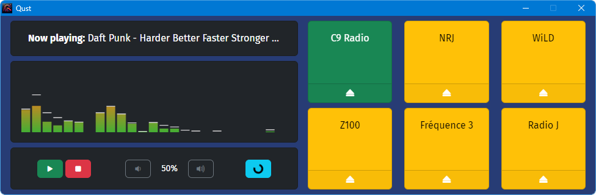

# Qust

### 
Efficient, cartridge-loaded, streaming software player

**Qust** is an open-source, simple, **qu**ick **st**reaming player.
  - Efficient player that leverages a native element for low-resource, efficient playback,
  - Features a cartridge-loading concept with persistent loading/saving system,
  - High-refresh, reliable audio visualizer for precise sound representation,
  - Supports global shortcuts (Ctrl + Alt + Insert / Ctrl + Alt + H),
  - Capable of handling title metadata for compatible streams,
  - Fully compatible with Icecast 2 streams,
  - Available for Windows & MacOS.